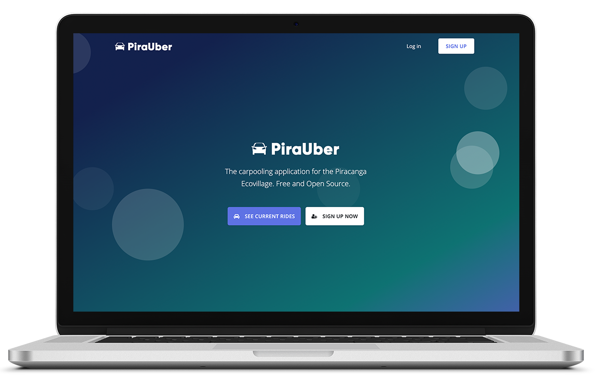
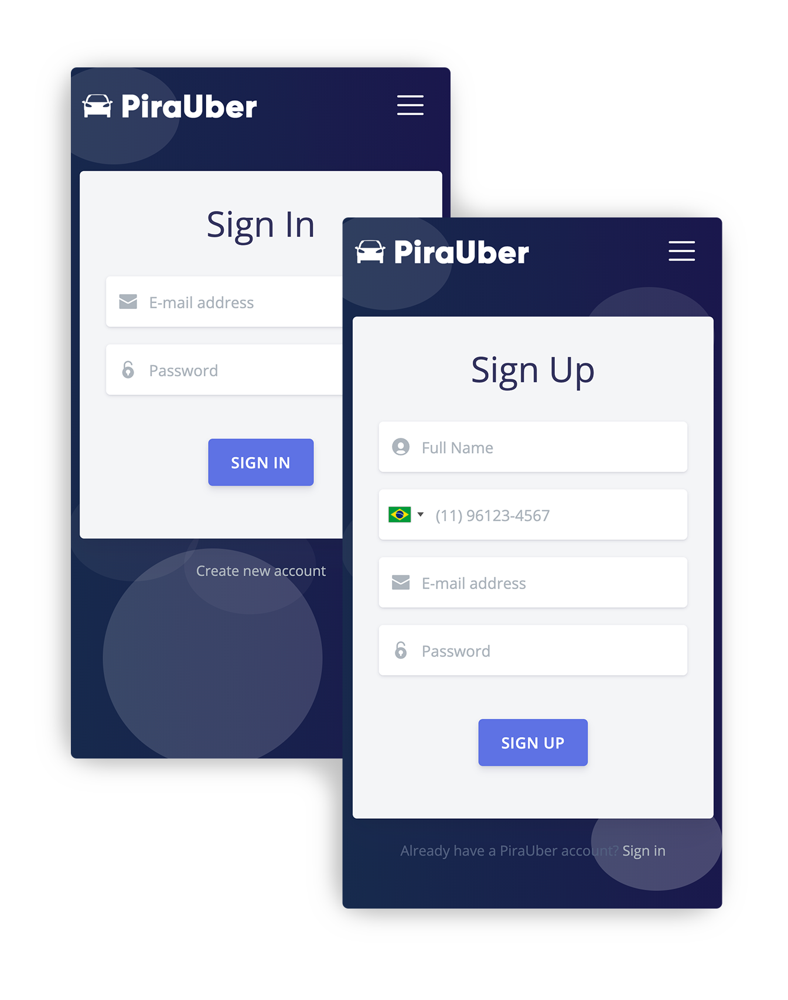

<h1 align="center">PiraUber  🚘🌴</h1>

  <strong>The carpooling application for the Piracanga Ecovillage.</strong>

	<strong>
		<a href="https://pirauber.herokuapp.com/">Website</a>
	</strong>

<a href="https://www.freepik.com/free-photos-vectors/mockup">Mockup psd created by aleksandr_samochernyi - www.freepik.com</a>

## Introduction

This is a carpooling application developed to be used in the Piracanga Ecovillage, Brazil.

Created with [Django](https://github.com/django/django) and [Bootstrap](https://getbootstrap.com/). The theme used was [Argon](https://www.creative-tim.com/product/argon-design-system).

## Features

A few of the things you can do with PiraUber:

* View available rides
* Create new rides
* Register and Log In

**New features will be added with feedback from the community**

## Feedback

Feel free to contact me or [file an issue](https://github.com/andrenbrandao/pirauber/issues/new). Feature requests are always welcome.

## License

This project is [MIT](LICENSE) licensed.

